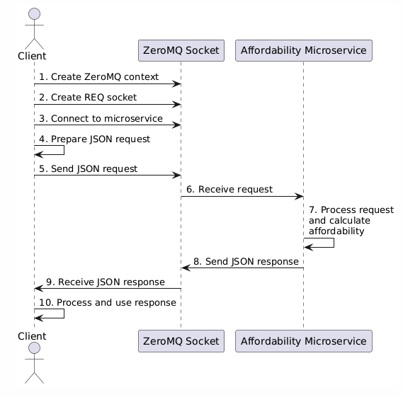

# Car Affordability Calculator Microservice

This microservice calculates the affordability of a car based on the user's monthly income and desired car payment.

## Prerequisites

- Python 3.6 or higher must be installed. You can download it from the [official website](https://www.python.org/downloads/).

## Installation

1. **Clone the repository:**

   ```bash
   git clone https://github.com/yourusername/car-affordability-calculator.git
   cd car-affordability-calculator
   ```

2. **Create a virtual environment:**

   ```bash
   python -m venv venv
   source venv/bin/activate  # On Windows use `venv\Scripts\activate`
   ```

3. **Install the required dependencies:**
   ```bash
   pip install -r requirements.txt
   ```

## Running the Service

1. **Start the Car Affordability Calculator microservice:**

   ```bash
   python affordability_microservice.py
   ```

2. The service will start and display the message:
   ```bash
   Car Affordability Calculator Microservice is running...
   ```

## Communication Contract

### Requesting Data

To request data from the Car Affordability Calculator microservice, send a JSON request to the ZeroMQ socket connected to the service address `tcp://localhost:5555`.

#### Request Parameters

The JSON request should contain the following keys:

- `monthly_income`: The user's monthly income (float)
- `car_payment`: The desired monthly car payment (float)

#### Example Request

```json
{
  "monthly_income": 5000,
  "car_payment": 400
}
```

### Receiving Data

The microservice will respond with a JSON object containing the result of the affordability calculation.

#### Response Parameters:

- affordability: A boolean indicating whether the car is affordable (True if the payment is <= 10% of monthly income)
- percentage: The percentage of monthly income that the car payment represents (float, rounded to two decimal places)

#### Example Response

```json
{
  "affordability": true,
  "percentage": 8.0
}
```

### Example Call

Here's a Python example demonstrating how to request and receive data from the microservice:

```python
import zmq
import json

context = zmq.Context()
socket = context.socket(zmq.REQ)
socket.connect("tcp://localhost:5555")

request = {
    "monthly_income": 5000,
    "car_payment": 400
}

socket.send_json(request)
response = socket.recv_json()

print("Affordability:", response["affordability"])
print("Percentage of Income:", response["percentage"])
```

## UML Sequence Diagram


